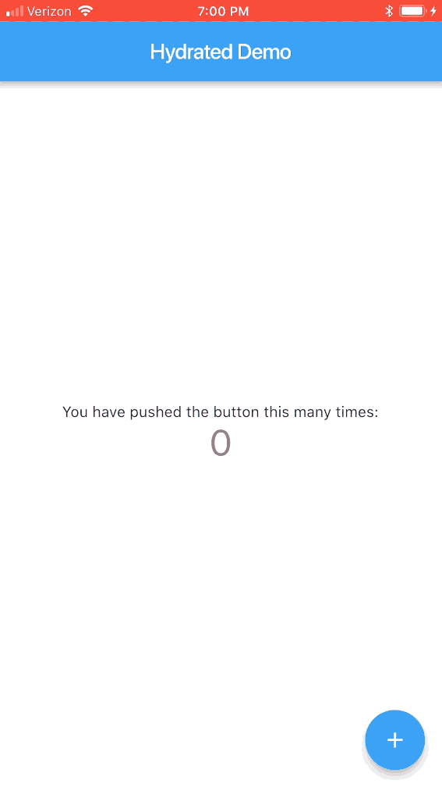

# Hydrated

Hydrated provides a BehaviorSubject that automatically persists to Flutter's local storage. Rehydrate on command!

## Easy to consume

All values are persisted with `shared_preferences` and restored with `hydrate()` at next app launch.

```dart
final count$ = HydratedSubject<int>("count", seedValue: 0); // persist
await count$.hydrate(); // hydrate

count$.add(42); // this value will be available on next app launch
```

## Ready for BLoC

```dart
class _Bloc {
  /// persist
  final count$ = HydratedSubject<int>("count", seedValue: 0);

  _Bloc() {
    /// hydrate
    this.count$.hydrate();
  }

  // ...
}
```

## Standard types

We support `shared_preferences` types.

- `int`
- `double`
- `bool`
- `String`
- `List<String>`

## Reliable

Hydrated is mock tested with all supported types against `shared_preferences`.


